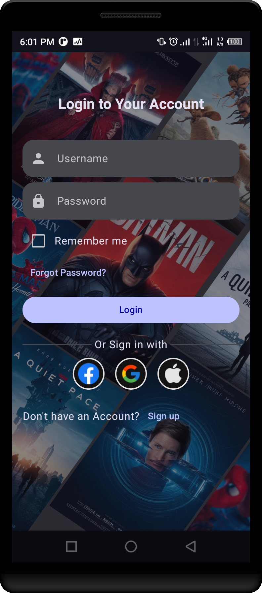
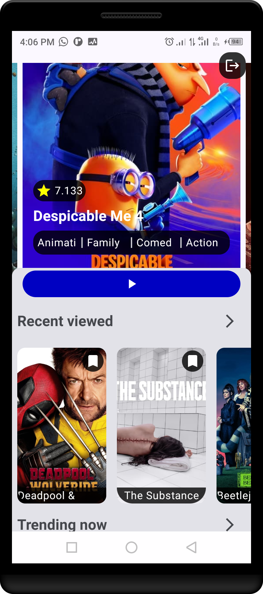
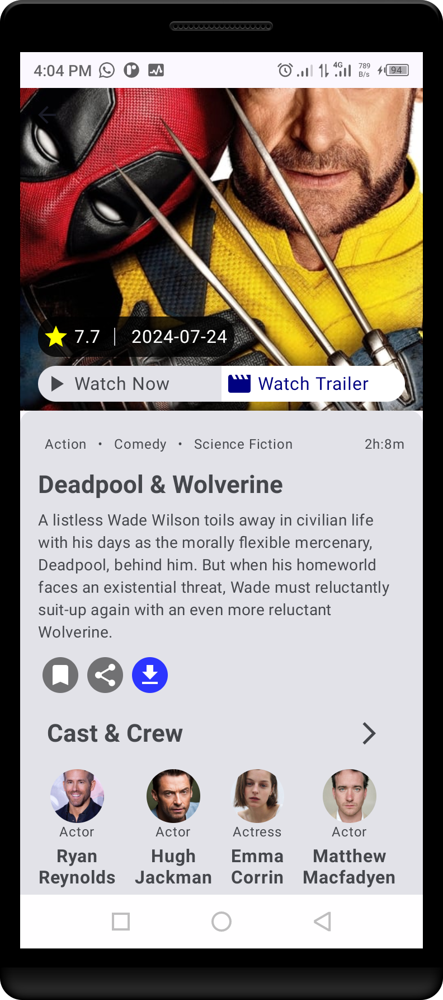
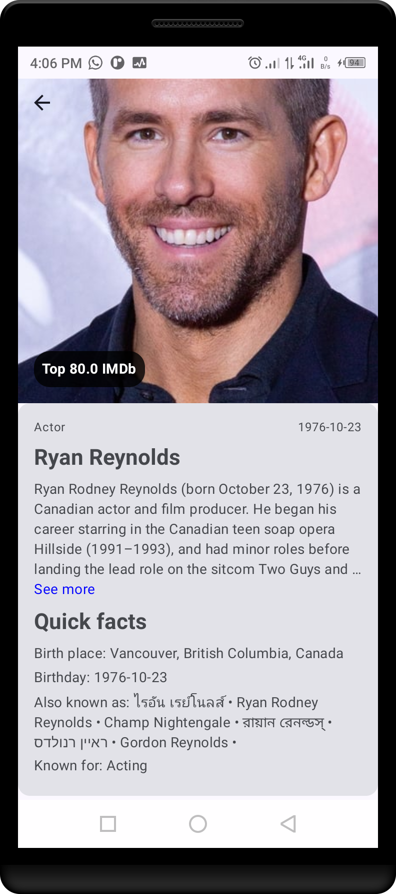
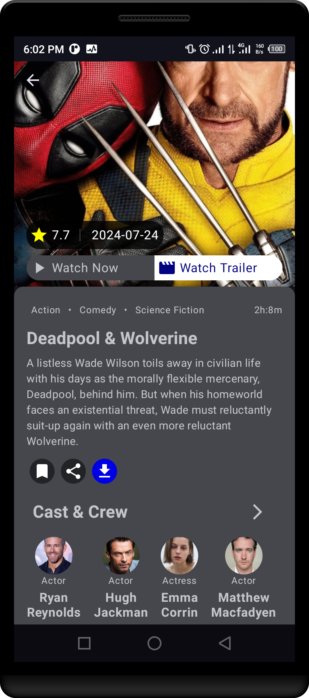

# Movie App

## Overview

The **Movie App** is an Android application built with
[Jetpack Compose](https://developer.android.com/jetpack/compose) has several features like discover, explore, and Actor details. With user-friendly browsing features and secure authentication via Firebase and Google Authentication. The app integrates with TheMovieDb API for fetching real-time movie data.

## Screenshots






## Features

### User Authentication
* **Sign up and Log in:**
    * Securely sign up or log in with an email and password.
    * Email verification for added security.
      *Google Authentication with oneTapClient.
### Movie Browsing
* **Discover Movies:**
    * Browse an extensive collection of films from various genres.
        * View detailed information, including posters, Actors, and more.


## Technologies Used

* **Kotlin**: The core programming language for the app.
* **Jetpack Compose**: Modern toolkit for building native Android UI.
* **Firebase**: Backend services for secure user authentication.
    * **Firebase Authentication**: For managing user sign-up, login, and verification.
* **Coroutines**: For handling asynchronous tasks and network requests.
* **Retrofit**: HTTP client for interacting with TheMovieDb API.
* **ViewModel**: Part of Android's architecture components for managing UI-related data.
* **StateFlow**: For reactive UI updates.
* **Kotlin Serialization**: Efficient JSON parsing and conversion to Kotlin objects.
* **Dagger Hilt**: Dependency injection framework for efficient code management.
* **Coil**: Image loading library for handling movie posters and images.

## Setup

1. **Clone the Repository:**
    ```
    git clone https://github.com/Hoodlab/Movie-App.git
    cd MovieApp
    ```

2. **Configure TheMovieDb API:**
    * Sign up for an API key from [TheMovieDb](https://www.themoviedb.org/).
    * In your project’s `local.properties` file, add the following:
      ```
      apiKey=YOUR_TMDB_API_KEY
      ```
    * The app will access this key via `BuildConfig.apiKey`.

3. **Set up Firebase:**
    * Create a Firebase project from the [Firebase Console](https://console.firebase.google.com/).
    * Enable **Firebase Authentication** With Email and Password and Google Auth.
    * Download the `google-services.json` file and place it in the `app/` directory.
    *Retrieve the WebClient secret key for Google Authentication from the [Firebase Console](https://console.firebase.google.com/).
    * In your project’s `local.properties` file, add the following:
      ```
      clientSecret=YOUR_FIREBASE_GOOGLE_AUTH_WEB_SECRET
      ```

4. **Build and Run:**
    * Open the project in Android Studio.
    * Build the app and run it on an emulator or a physical device.

## Usage

1. **User Registration & Login:**
    * New users can sign up with their email and password.
    * Existing users can log in using their credentials.
2. **Browse Movies:**
    * Explore the movie catalog or search for specific titles.
    * Tap on a movie to view more details such as trailers, reviews, and cast.
3. **Profile Management:**
    * Access and update your account details.
    * View your watch history or create and edit your watchlists.

## Project Structure

The project is structured using the MVVM (Model-View-ViewModel) architecture with clean architecture principles to ensure separation of concerns and modularity

### Key Components
* **actor_detail/**: Handles everything related to actors, including fetching actor details from the API and displaying them in the UI.
  authentication/: Manages user authentication (login, sign-up, etc.), using Firebase for backend services.
* **common/**: Common utilities and mappers that are shared across the app.
* **di/**: Dagger Hilt is used for dependency injection to manage different components such as repositories and ViewModels.
* **ui/**: Contains all the UI screens and components, built with Jetpack Compose, making the app's interface reactive and dynamic.
* **utils/**: A collection of utility functions, constants, and extensions to simplify code across the app.
  navigation/: Manages app navigation using Jetpack Compose's Navigation component.
  MainActivity.kt: The entry point for the app that initializes the UI and handles overall navigation.


### Additional packages

* **data:** Contains data models, repositories, and network-related classes.
* **domain:** Defines domain-specific entities and interfaces.
* **di:** Handles dependency injection.
* **navigation:** Manages navigation between screens.

### Key Components

* **Models:** Classes representing data entities (e.g., Actor, Movie).
* **Repositories:** Interfaces for accessing data (e.g., ActorRepository, MovieRepository).
* **ViewModels:** Classes that handle UI logic and data binding.
* **Screens:** Jetpack compose Function representing individual UI screens.
* **Components:** Reusable UI elements (e.g., buttons, text views).

### Navigation

* **MovieNavGraph.kt:** Defines the navigation graph for the app.
* **MovieNavigationActions.kt:** Actions used for navigation.

### Dependencies

* Coil  for Image Loading
* Retrofit for Networking
* Dagger Hilt for Dependency Injection
* Kotlin Serialization  for Json parsing
* firebase for user Authentication

## Prerequisites

To work on this project, you need to use **Android Studio Koala | 2024.1.1** or a later version. This ensures compatibility with the project's dependencies and tools, including Jetpack Compose, Dagger Hilt, and other modern Android development features.

